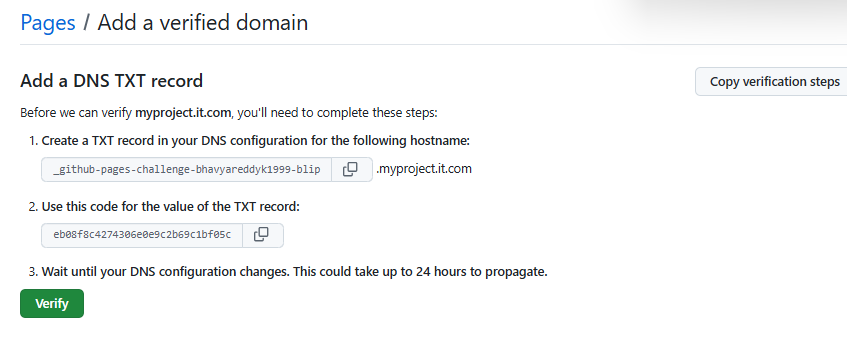
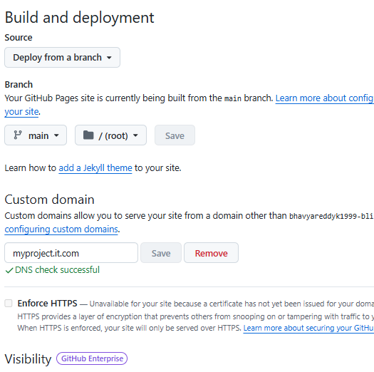

# Basic DNS Setup Project

This project was about learning and practicing the basics of DNS by setting up a custom domain with **Namecheap** and connecting it to **GitHub Pages**.

---

## 🔹 Steps I Followed

### 1. Buying the Domain
- I purchased the domain `myprojectit.com` from **Namecheap**.
- Enabled free domain privacy to keep my info safe.

### 2. DNS Setup
- Went into **Namecheap → Advanced DNS**.
- Added these records:
  - **A Records** → Pointed `@` to GitHub Pages IPs:
    - 185.199.108.153  
    - 185.199.109.153  
    - 185.199.110.153  
    - 185.199.111.153
  - **CNAME Record** → Pointed `www` to `bhavyareddyk1999-blip.github.io`.
  - **TXT Record** → Added GitHub verification code for domain ownership.

### 3. GitHub Pages Setup
- Created a repo called **basic-dns-setup**.
- Added an `index.html` file for the homepage.
- Went to **Settings → Pages** in the repo:
  - Source = `main branch /root`.
  - Added **Custom Domain**: `myprojectit.com`.
  - Enabled ✅ **Enforce HTTPS** once SSL was ready.

### 4. Result
- Website is now live 🎉  
👉 [https://myprojectit.com](https://myprojectit.com)

---

## 📸 Screenshots
Here are the screenshots of my setup:

- Domain purchase  
  

- Advanced DNS setup  
  

- GitHub TXT verification  
  

- GitHub Pages custom domain setup  
  

---

## ✅ What I Learned
- How DNS records (A, CNAME, TXT) work.
- How to connect a domain to GitHub Pages.
- How to enable HTTPS for a secure site.

